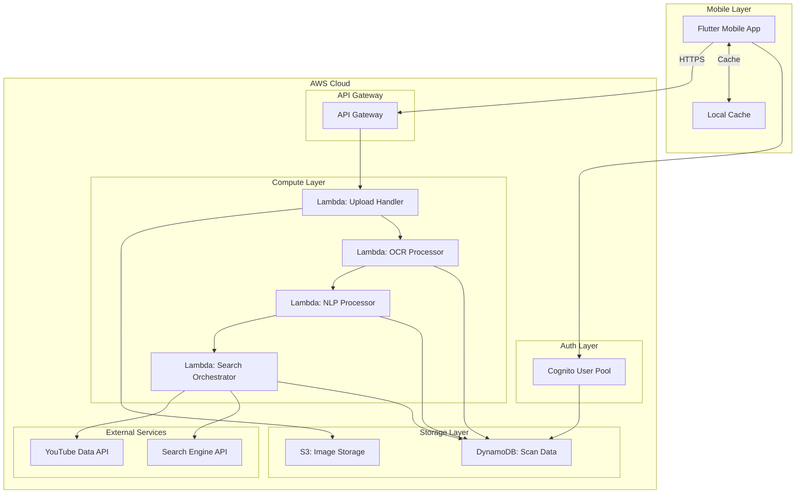

# Design Document: Lens for E-Learning MVP

## Overview

Lens for E-Learning is a mobile-first educational platform that transforms physical textbook content into curated digital learning resources. The system employs a serverless architecture on AWS, combining computer vision (OCR), natural language processing, and intelligent search to deliver a seamless learning experience.

The architecture follows a three-tier model:
- **Presentation Layer**: Flutter mobile app (iOS/Android) with offline-first capabilities
- **Application Layer**: FastAPI REST API on AWS Lambda with stateless processing
- **Data Layer**: AWS managed services (S3, DynamoDB, Cognito) for storage and authentication

The processing pipeline executes sequentially: Image Upload → OCR → Summarization → Keyword Extraction → Resource Search. Each stage is designed for failure isolation, allowing graceful degradation and detailed error reporting.

Key design principles:
- **Cost-conscious**: Operate within AWS free tier (1M Lambda requests, 25GB DynamoDB, 5GB S3)
- **Performance-focused**: 30-second end-to-end processing for 90% of requests
- **Offline-capable**: Local caching for scan history and results
- **Scalable foundation**: Support 50-100 active users with 10,000 monthly scans

## Architecture

### System Architecture Diagram



### Architecture Patterns

**Serverless Event-Driven Processing**
- Each pipeline stage is an independent Lambda function
- Asynchronous invocation between stages using Lambda event payloads
- Enables parallel processing and automatic scaling

**Offline-First Mobile Design**
- Local SQLite database for scan history and results
- Background sync when connectivity restored
- Optimistic UI updates with conflict resolution

**API Gateway + Lambda Integration**
- RESTful API design with resource-based routing
- JWT token authentication via Cognito authorizer
- Request/response transformation at gateway level

### Technology Stack

**Mobile Application**
- **Framework**: Flutter 3.x (Dart)
- **State Management**: Provider pattern
- **Local Storage**: sqflite for structured data, shared_preferences for settings
- **HTTP Client**: dio with retry interceptors
- **Image Processing**: image_picker, image package for compression
- **Camera**: camera plugin for native camera access

**Backend Services**
- **API Framework**: FastAPI 0.104+ (Python 3.11)
- **OCR Engine**: Tesseract 5.x via pytesseract
- **NLP Library**: spaCy 3.7+ with en_core_web_sm model
- **Keyword Extraction**: RAKE (Rapid Automatic Keyword Extraction) via rake-nltk
- **HTTP Client**: httpx for async external API calls
- **Validation**: Pydantic v2 for request/response models

**AWS Infrastructure**
- **Compute**: Lambda (Python 3.11 runtime, 1024MB memory, 15min timeout)
- **API**: API Gateway (REST API with Cognito authorizer)
- **Storage**: S3 (Standard storage class with lifecycle policies)
- **Database**: DynamoDB (On-demand billing mode)
- **Authentication**: Cognito User Pools with email verification
- **Monitoring**: CloudWatch Logs (7-day retention)

**External APIs**
- **YouTube**: YouTube Data API v3 for video search
- **Web Search**: Google Custom Search API or Bing Search API
- **Rate Limiting**: Token bucket algorithm with Redis (ElastiCache free tier)

## Components and Interfaces

### Mobile App Components

#### 1. Authentication Module
**Responsibility**: Manage user authentication state and token lifecycle

**Key Classes**:
- `AuthService`: Handles Cognito SDK interactions
- `AuthProvider`: State management for auth status
- `TokenManager`: Secure storage and refresh of JWT tokens

**Interfaces**:
```dart
abstract class IAuthService {
  Future<AuthResult> register(String email, String password);
  Future<AuthResult> login(String email, String password);
  Future<AuthResult> loginWithGoogle();
  Future<AuthResult> loginWithFacebook();
  Future<void> logout();
  Future<bool> verifyEmail(String code);
  Future<String> getValidToken();
}
```

#### 2. Camera Module
**Responsibility**: Capture and prepare images for upload

**Key Classes**:
- `CameraController`: Manages camera lifecycle
- `ImageCompressor`: Client-side compression to 2MB max
- `ImageValidator`: Checks format and quality

**Interfaces**:
```dart
abstract class ICameraService {
  Future<CapturedImage> captureImage();
  Future<CapturedImage> pickFromGallery();
  Future<CompressedImage> compressImage(CapturedImage image, int maxSizeBytes);
}
```

#### 3. Scan Processing Module
**Responsibility**: Orchestrate scan workflow and display progress

**Key Classes**:
- `ScanOrchestrator`: Manages upload and polling
- `ProgressTracker`: Tracks pipeline stages
- `ResultsCache`: Local persistence of scan results

**Interfaces**:
```dart
abstract class IScanService {
  Stream<ScanProgress> processScan(CompressedImage image);
  Future<ScanResult> getScanResult(String scanId);
  Future<List<ScanHistory>> getHistory({int limit, int offset});
  Future<void> deleteScan(String scanId);
}
```

#### 4. Results Display Module
**Responsibility**: Present learning resources in organized views

**Key Classes**:
- `ResultsViewModel`: Formats results for display
- `ResourceLauncher`: Opens external URLs
- `BookmarkManager`: Manages saved resources

**Interfaces**:
```dart
abstract class IResultsService {
  Future<void> bookmarkResource(String scanId, Resource resource);
  Future<List<Resource>> getBookmarks();
  Future<void> shareResults(ScanResult result);
  Future<void> openResource(Resource resource);
}
```

### Backend API Components

#### 1. Upload Handler (Lambda)
**Responsibility**: Receive image uploads and initiate processing

**Endpoint**: `POST /api/v1/scans`

**Request**:
```python
class ScanRequest(BaseModel):
    image_data: str  # Base64 encoded image
    image_format: str  # jpeg, png, heic
    user_id: str
```

**Response**:
```python
class ScanResponse(BaseModel):
    scan_id: str
    status: str  # "processing"
    upload_url: str  # S3 presigned URL
    estimated_time: int  # seconds
```

**Processing Flow**:
1. Validate image format and size
2. Generate unique scan_id (UUID)
3. Upload to S3: `scans/{user_id}/{scan_id}/original.{ext}`
4. Create DynamoDB record with status="processing"
5. Invoke OCR Lambda asynchronously
6. Return scan_id to client

#### 2. OCR Processor (Lambda)
**Responsibility**: Extract text from uploaded images

**Trigger**: Asynchronous Lambda invocation from Upload Handler

**Event Payload**:
```python
class OCREvent(BaseModel):
    scan_id: str
    user_id: str
    image_s3_key: str
```

**Processing Flow**:
1. Download image from S3
2. Preprocess image (grayscale, contrast enhancement)
3. Run Tesseract OCR with confidence scores
4. Validate minimum 50 characters extracted
5. Store extracted text in DynamoDB
6. Update scan status to "ocr_complete"
7. Invoke NLP Lambda asynchronously

**OCR Configuration**:
```python
tesseract_config = {
    'lang': 'eng',
    'oem': 3,  # LSTM neural net mode
    'psm': 3,  # Fully automatic page segmentation
}
```

#### 3. NLP Processor (Lambda)
**Responsibility**: Summarize text and extract keywords

**Trigger**: Asynchronous Lambda invocation from OCR Processor

**Event Payload**:
```python
class NLPEvent(BaseModel):
    scan_id: str
    user_id: str
    extracted_text: str
```

**Processing Flow**:
1. Load spaCy model (cached in /tmp)
2. Generate summary:
   - If text > 500 words: Extract top-ranked sentences to 150-200 words
   - If text < 100 words: Use original text
3. Extract keywords using RAKE:
   - Return 5-15 key phrases
   - Prioritize multi-word phrases
   - Rank by relevance score
4. Store summary and keywords in DynamoDB
5. Update scan status to "nlp_complete"
6. Invoke Search Lambda asynchronously

**Summarization Algorithm**:
```python
def summarize(text: str, target_words: int = 175) -> str:
    doc = nlp(text)
    sentences = list(doc.sents)
    
    # Score sentences by importance
    scores = {}
    for sent in sentences:
        score = sum(token.rank for token in sent if not token.is_stop)
        scores[sent] = score / len(sent)
    
    # Select top sentences until target word count
    ranked = sorted(sentences, key=lambda s: scores[s], reverse=True)
    summary_sents = []
    word_count = 0
    
    for sent in ranked:
        if word_count + len(sent) <= target_words:
            summary_sents.append(sent)
            word_count += len(sent)
        else:
            break
    
    # Return in original order
    summary_sents.sort(key=lambda s: s.start)
    return ' '.join(str(s) for s in summary_sents)
```

#### 4. Search Orchestrator (Lambda)
**Responsibility**: Query external APIs for learning resources

**Trigger**: Asynchronous Lambda invocation from NLP Processor

**Event Payload**:
```python
class SearchEvent(BaseModel):
    scan_id: str
    user_id: str
    keywords: List[str]
    summary: str
```

**Processing Flow**:
1. Construct search queries from top 5 keywords
2. Execute parallel searches:
   - YouTube Data API for videos
   - Custom Search API for articles
   - Custom Search API for websites
3. Deduplicate and rank results
4. Store results in DynamoDB (max 10 per category)
5. Update scan status to "complete"
6. Send notification to mobile app (optional push)

**Search Query Construction**:
```python
def build_search_query(keywords: List[str], max_keywords: int = 3) -> str:
    # Use top N keywords, prefer multi-word phrases
    top_keywords = sorted(keywords, key=lambda k: len(k.split()), reverse=True)[:max_keywords]
    return ' '.join(top_keywords)
```

**YouTube Search**:
```python
async def search_youtube(query: str, max_results: int = 10) -> List[VideoResource]:
    params = {
        'part': 'snippet',
        'q': query,
        'type': 'video',
        'maxResults': max_results,
        'relevanceLanguage': 'en',
        'videoDefinition': 'any',
        'videoEmbeddable': 'true',
    }
    response = await youtube_client.search().list(**params).execute()
    return [VideoResource.from_youtube_item(item) for item in response['items']]
```

### API Endpoints

#### Authentication Endpoints
```
POST   /api/v1/auth/register
POST   /api/v1/auth/login
POST   /api/v1/auth/logout
POST   /api/v1/auth/refresh
POST   /api/v1/auth/verify-email
GET    /api/v1/auth/me
```

#### Scan Endpoints
```
POST   /api/v1/scans              # Create new scan
GET    /api/v1/scans/{scan_id}    # Get scan status and results
GET    /api/v1/scans              # List user's scan history
DELETE /api/v1/scans/{scan_id}    # Delete scan
```

#### Resource Endpoints
```
POST   /api/v1/scans/{scan_id}/bookmarks    # Bookmark a resource
GET    /api/v1/bookmarks                    # Get all bookmarks
DELETE /api/v1/bookmarks/{bookmark_id}      # Remove bookmark
```

#### Health Endpoint
```
GET    /api/v1/health             # API health check
```

## Data Models

### DynamoDB Table Design

**Single Table Design**: `lens-elearning-prod`

**Partition Key**: `PK` (String)
**Sort Key**: `SK` (String)
**GSI1**: `GSI1PK` / `GSI1SK` for query patterns

#### Access Patterns

1. Get user by user_id: `PK=USER#{user_id}`, `SK=PROFILE`
2. Get scan by scan_id: `PK=SCAN#{scan_id}`, `SK=METADATA`
3. Get user's scans: `GSI1PK=USER#{user_id}`, `GSI1SK` begins_with `SCAN#`
4. Get scan results: `PK=SCAN#{scan_id}`, `SK=RESULTS`
5. Get user bookmarks: `PK=USER#{user_id}`, `SK` begins_with `BOOKMARK#`

#### Entity Schemas

**User Entity**:
```python
{
    'PK': 'USER#<user_id>',
    'SK': 'PROFILE',
    'email': str,
    'created_at': str,  # ISO 8601
    'last_login': str,
    'scan_count': int,
    'subscription_tier': str,  # 'free', 'premium'
}
```

**Scan Metadata Entity**:
```python
{
    'PK': 'SCAN#<scan_id>',
    'SK': 'METADATA',
    'GSI1PK': 'USER#<user_id>',
    'GSI1SK': 'SCAN#<timestamp>',
    'user_id': str,
    'status': str,  # 'processing', 'ocr_complete', 'nlp_complete', 'complete', 'failed'
    'created_at': str,
    'updated_at': str,
    'image_s3_key': str,
    'image_thumbnail_url': str,
    'error_message': Optional[str],
    'processing_time_ms': Optional[int],
}
```

**Scan OCR Data Entity**:
```python
{
    'PK': 'SCAN#<scan_id>',
    'SK': 'OCR_DATA',
    'extracted_text': str,
    'confidence_score': float,  # 0.0 to 1.0
    'character_count': int,
    'processed_at': str,
}
```

**Scan NLP Data Entity**:
```python
{
    'PK': 'SCAN#<scan_id>',
    'SK': 'NLP_DATA',
    'summary': str,
    'keywords': List[str],
    'keyword_scores': Dict[str, float],
    'processed_at': str,
}
```

**Scan Results Entity**:
```python
{
    'PK': 'SCAN#<scan_id>',
    'SK': 'RESULTS',
    'videos': List[VideoResource],
    'articles': List[ArticleResource],
    'websites': List[WebsiteResource],
    'total_results': int,
    'search_queries': List[str],
    'processed_at': str,
}
```

**Bookmark Entity**:
```python
{
    'PK': 'USER#<user_id>',
    'SK': 'BOOKMARK#<bookmark_id>',
    'scan_id': str,
    'resource_type': str,  # 'video', 'article', 'website'
    'resource_url': str,
    'resource_title': str,
    'resource_description': str,
    'bookmarked_at': str,
}
```

### Resource Models

**VideoResource**:
```python
class VideoResource(BaseModel):
    video_id: str
    title: str
    description: str
    thumbnail_url: str
    channel_name: str
    duration: str  # ISO 8601 duration
    view_count: int
    published_at: str
    url: str  # Full YouTube URL
```

**ArticleResource**:
```python
class ArticleResource(BaseModel):
    url: str
    title: str
    description: str
    source: str  # Domain name
    published_at: Optional[str]
    author: Optional[str]
    thumbnail_url: Optional[str]
```

**WebsiteResource**:
```python
class WebsiteResource(BaseModel):
    url: str
    title: str
    description: str
    domain: str
    favicon_url: Optional[str]
```

### Mobile App Data Models

**Local SQLite Schema**:

```sql
CREATE TABLE scans (
    scan_id TEXT PRIMARY KEY,
    user_id TEXT NOT NULL,
    status TEXT NOT NULL,
    created_at TEXT NOT NULL,
    updated_at TEXT NOT NULL,
    image_local_path TEXT,
    image_thumbnail_url TEXT,
    summary TEXT,
    error_message TEXT,
    synced INTEGER DEFAULT 0
);

CREATE TABLE scan_keywords (
    id INTEGER PRIMARY KEY AUTOINCREMENT,
    scan_id TEXT NOT NULL,
    keyword TEXT NOT NULL,
    score REAL,
    FOREIGN KEY (scan_id) REFERENCES scans(scan_id) ON DELETE CASCADE
);

CREATE TABLE resources (
    id INTEGER PRIMARY KEY AUTOINCREMENT,
    scan_id TEXT NOT NULL,
    resource_type TEXT NOT NULL,
    url TEXT NOT NULL,
    title TEXT NOT NULL,
    description TEXT,
    metadata TEXT,  -- JSON blob
    FOREIGN KEY (scan_id) REFERENCES scans(scan_id) ON DELETE CASCADE
);

CREATE TABLE bookmarks (
    bookmark_id TEXT PRIMARY KEY,
    scan_id TEXT NOT NULL,
    resource_id INTEGER NOT NULL,
    bookmarked_at TEXT NOT NULL,
    synced INTEGER DEFAULT 0,
    FOREIGN KEY (resource_id) REFERENCES resources(id) ON DELETE CASCADE
);

CREATE INDEX idx_scans_user_created ON scans(user_id, created_at DESC);
CREATE INDEX idx_resources_scan ON resources(scan_id);
CREATE INDEX idx_bookmarks_scan ON bookmarks(scan_id);
```

### S3 Storage Structure

```
lens-elearning-images/
├── scans/
│   └── {user_id}/
│       └── {scan_id}/
│           ├── original.{ext}      # Original uploaded image
│           └── thumbnail.jpg       # 200x200 thumbnail
└── temp/
    └── {upload_id}.{ext}          # Temporary uploads (lifecycle: 1 day)
```

**S3 Lifecycle Policies**:
- Delete objects in `temp/` after 1 day
- Transition `scans/` to Intelligent-Tiering after 30 days
- Delete scans older than 1 year (optional, configurable)


## Correctness Properties

*A property is a characteristic or behavior that should hold true across all valid executions of a system—essentially, a formal statement about what the system should do. Properties serve as the bridge between human-readable specifications and machine-verifiable correctness guarantees.*

### Authentication Properties

**Property 1: Account Creation Consistency**
*For any* valid email and password combination, when a user registers, the Auth_Service should create a user account that can be retrieved by user_id.
**Validates: Requirements 1.1**

**Property 2: Token Validity Period**
*For any* successful login, the returned authentication token should have an expiration time exactly 30 days from issuance.
**Validates: Requirements 1.3**

**Property 3: Invalid Credentials Rejection**
*For any* invalid credential combination (wrong password, non-existent email, malformed input), the Auth_Service should reject the login attempt and return an error.
**Validates: Requirements 1.4**

**Property 4: Token Expiry Triggers Re-authentication**
*For any* expired authentication token, attempting to use it should trigger a re-authentication prompt in the Mobile_App.
**Validates: Requirements 1.6**

**Property 5: Logout Clears All Tokens**
*For any* authenticated session, after logout, no authentication tokens should remain in local storage.
**Validates: Requirements 1.7**

### Image Upload Properties

**Property 6: Local Save Before Upload**
*For any* captured or selected image, the image should be saved to local storage before the upload to S3 begins.
**Validates: Requirements 2.2**

**Property 7: Format Validation**
*For any* image file, the Mobile_App should accept JPEG, PNG, and HEIC formats and reject all other formats.
**Validates: Requirements 2.3**

**Property 8: Compression Size Limit**
*For any* image, after compression, the resulting file size should be at most 2MB.
**Validates: Requirements 2.4**

**Property 9: Upload Identifier Uniqueness**
*For any* two image uploads, their generated identifiers (scan_id) should be distinct.
**Validates: Requirements 2.5**

**Property 10: Upload Retry Logic**
*For any* failed upload, the Mobile_App should retry up to 3 times with exponential backoff before reporting failure.
**Validates: Requirements 2.6**

**Property 11: Upload Confirmation Round-Trip**
*For any* successful image upload, the Mobile_App should receive a confirmation containing a valid S3 URL that can be used to retrieve the image.
**Validates: Requirements 2.7**

### OCR Processing Properties

**Property 12: OCR Trigger on Upload**
*For any* uploaded image, the Backend_API should trigger OCR processing within the processing pipeline.
**Validates: Requirements 3.1**

**Property 13: OCR Response Structure**
*For any* successful OCR operation, the response should contain both extracted text and a confidence score between 0.0 and 1.0.
**Validates: Requirements 3.3**

**Property 14: OCR Result Persistence**
*For any* successful OCR operation, storing the extracted text in DynamoDB and then retrieving it by scan_id should return the same text.
**Validates: Requirements 3.7**

**Property 15: OCR Error Propagation**
*For any* OCR processing failure, the Backend_API should return a structured error response to the Mobile_App.
**Validates: Requirements 3.5**

### Summarization Properties

**Property 16: Summary Generation**
*For any* extracted text, the NLP_Service should generate a summary (which may be the original text if short enough).
**Validates: Requirements 4.1**

**Property 17: Long Text Summarization**
*For any* text exceeding 500 words, the generated summary should be between 150 and 200 words.
**Validates: Requirements 4.3**

**Property 18: Short Text Idempotence**
*For any* text with fewer than 100 words, the summary should be identical to the original text.
**Validates: Requirements 4.4**

**Property 19: Summary Persistence Round-Trip**
*For any* generated summary, storing it in DynamoDB and then retrieving it by scan_id should return the same summary.
**Validates: Requirements 4.5**

**Property 20: Summarization Fallback**
*For any* summarization failure, the Backend_API should use the original extracted text as the summary.
**Validates: Requirements 4.6**

### Keyword Extraction Properties

**Property 21: Keyword Extraction Trigger**
*For any* completed summarization, the Keyword_Extractor should be invoked to extract key phrases.
**Validates: Requirements 5.1**

**Property 22: Keyword Count Bounds**
*For any* text, the Keyword_Extractor should return between 5 and 15 key phrases (inclusive).
**Validates: Requirements 5.2**

**Property 23: Multi-word Phrase Prioritization**
*For any* text containing both single-word and multi-word technical terms, multi-word phrases should rank higher in the keyword list.
**Validates: Requirements 5.3**

**Property 24: Keyword Persistence Round-Trip**
*For any* extracted keywords, storing them in DynamoDB and then retrieving them by scan_id should return the same keyword list.
**Validates: Requirements 5.4**

**Property 25: Keyword Extraction Failure Halts Pipeline**
*For any* keyword extraction failure, the Backend_API should return an error and not proceed to the search stage.
**Validates: Requirements 5.5**

### Search Properties

**Property 26: Search Trigger on Keyword Completion**
*For any* completed keyword extraction, the Search_Service should be invoked to find learning resources.
**Validates: Requirements 6.1**

**Property 27: Three-Category Search Results**
*For any* search operation, the results should include all three categories: videos, articles, and websites (though any category may be empty).
**Validates: Requirements 6.2**

**Property 28: Video Result Count Bounds**
*For any* search that returns videos, the number of video results should be between 3 and 10 (inclusive), or 0 if no videos are found.
**Validates: Requirements 6.3**

**Property 29: Article Result Count Bounds**
*For any* search that returns articles, the number of article results should be between 3 and 10 (inclusive), or 0 if no articles are found.
**Validates: Requirements 6.4**

**Property 30: Website Result Count Bounds**
*For any* search that returns websites, the number of website results should be between 3 and 10 (inclusive), or 0 if no websites are found.
**Validates: Requirements 6.5**

**Property 31: Search Result Metadata Completeness**
*For any* search result (video, article, or website), the stored record should contain all required fields: title, URL, description, and category.
**Validates: Requirements 6.6**

### Results Display Properties

**Property 32: Result Field Display Completeness**
*For any* displayed resource, the UI should show the title, description, and source URL.
**Validates: Requirements 7.2**

**Property 33: Bookmark Functionality**
*For any* resource, the user should be able to bookmark it, and the bookmark should be accessible from the bookmarks list.
**Validates: Requirements 7.4**

**Property 34: Bookmark Persistence Round-Trip**
*For any* bookmarked resource, storing the bookmark in DynamoDB and then retrieving it should return the same bookmark data.
**Validates: Requirements 7.5**

**Property 35: Results Display Includes Context**
*For any* scan result display, both the original image thumbnail and the extracted summary should be visible.
**Validates: Requirements 7.6**

### History and Offline Properties

**Property 36: History Chronological Ordering**
*For any* set of scans, when displayed in history view, they should be ordered by creation date in descending order (newest first).
**Validates: Requirements 8.1**

**Property 37: History Item Display Completeness**
*For any* history item, the display should include scan date, thumbnail image, and summary preview.
**Validates: Requirements 8.2**

**Property 38: Result Caching Round-Trip**
*For any* scan result received from the API, caching it locally and then retrieving it should return the same result data.
**Validates: Requirements 8.4**

**Property 39: Offline Access to Cached Data**
*For any* cached scan result, it should be accessible when the device is offline (network disabled).
**Validates: Requirements 8.5**

**Property 40: Deletion Consistency**
*For any* scan deletion, the scan should be removed from both local cache and DynamoDB, and subsequent queries should not return it.
**Validates: Requirements 8.6**

**Property 41: History Search and Filtering**
*For any* search query or date range filter, the history view should only display scans matching the criteria.
**Validates: Requirements 8.7**

### Processing Status Properties

**Property 42: Upload Progress Indication**
*For any* image upload, progress updates should be emitted showing percentage completion from 0% to 100%.
**Validates: Requirements 9.1**

**Property 43: Pipeline Stage Status Messages**
*For any* scan processing, status messages should be displayed for all four stages: OCR, Summarization, Keyword Extraction, and Search.
**Validates: Requirements 9.2**

**Property 44: Progress Monotonicity**
*For any* processing pipeline, the progress indicator should never decrease (monotonically increasing).
**Validates: Requirements 9.3**

**Property 45: Success Navigation**
*For any* successfully completed scan, the Mobile_App should display a success message and navigate to the results view.
**Validates: Requirements 9.4**

**Property 46: Stage-Specific Error Messages**
*For any* processing failure, the error message should identify which pipeline stage failed (OCR, Summarization, Keyword Extraction, or Search).
**Validates: Requirements 9.5**

**Property 47: Background Processing Continuation**
*For any* scan processing, if the user navigates away, processing should continue in the background and complete successfully.
**Validates: Requirements 9.7**

### Cost Optimization Properties

**Property 48: Image Compression on Storage**
*For any* image stored in S3, it should be compressed, and the stored size should be less than or equal to the original size.
**Validates: Requirements 10.1**

**Property 49: Duplicate Image Caching**
*For any* two identical images (same content hash), the second upload should return cached results without reprocessing.
**Validates: Requirements 10.2**

**Property 50: Lambda Execution Time Limit**
*For any* Lambda function execution, the processing time should be less than 15 minutes (900 seconds).
**Validates: Requirements 10.3**

**Property 51: Metrics Logging**
*For any* API operation, metrics should be logged to CloudWatch for monitoring.
**Validates: Requirements 10.7**

### Error Handling Properties

**Property 52: Offline Operation Queueing**
*For any* operation attempted while offline, the Mobile_App should display an offline message and queue the operation for retry when connectivity is restored.
**Validates: Requirements 11.1**

**Property 53: API Retry with Exponential Backoff**
*For any* failed API request, the Mobile_App should retry up to 3 times with exponentially increasing delays between attempts.
**Validates: Requirements 11.2**

**Property 54: Retry Exhaustion Error Display**
*For any* API request where all 3 retry attempts fail, the Mobile_App should display a user-friendly error message with suggested actions.
**Validates: Requirements 11.3**

**Property 55: Error Logging with Context**
*For any* error in the Backend_API, a log entry should be created containing error details and contextual information (scan_id, user_id, stage).
**Validates: Requirements 11.4**

**Property 56: Structured Error Responses**
*For any* processing failure, the Backend_API should return a JSON response containing an error code and a descriptive message.
**Validates: Requirements 11.5**

**Property 57: Rate Limit Response Format**
*For any* request that exceeds rate limits, the Backend_API should return HTTP 429 status with a Retry-After header.
**Validates: Requirements 11.7**

### Performance Properties

**Property 58: Pipeline Processing Time**
*For any* scan, the total processing time from upload to results should be measured, and 90% of scans should complete within 30 seconds.
**Validates: Requirements 12.1**

**Property 59: Concurrent Scan Processing**
*For any* two scans submitted simultaneously, they should be processed by separate Lambda invocations (verified by distinct execution IDs).
**Validates: Requirements 12.2**

**Property 60: History Load Time**
*For any* history view load, the first 20 results should be displayed within 2 seconds.
**Validates: Requirements 12.3**

**Property 61: History Pagination**
*For any* history list with more than 20 items, scrolling to the bottom should trigger loading of the next page of results.
**Validates: Requirements 12.4**

**Property 62: Parallel Search Execution**
*For any* search operation, queries to YouTube, article sources, and website sources should execute in parallel (verified by overlapping execution times).
**Validates: Requirements 12.5**

**Property 63: Client-Side Image Compression**
*For any* image upload, compression should occur on the client before network transmission (verified by comparing pre-upload and uploaded sizes).
**Validates: Requirements 12.6**

## Error Handling

### Error Categories

**Client Errors (4xx)**
- `400 Bad Request`: Invalid request format, missing required fields
- `401 Unauthorized`: Missing or invalid authentication token
- `403 Forbidden`: Valid token but insufficient permissions
- `404 Not Found`: Requested scan or resource does not exist
- `413 Payload Too Large`: Image exceeds maximum size (2MB after compression)
- `422 Unprocessable Entity`: Valid format but business logic validation failed
- `429 Too Many Requests`: Rate limit exceeded

**Server Errors (5xx)**
- `500 Internal Server Error`: Unexpected server error
- `502 Bad Gateway`: External API (YouTube, Search) failure
- `503 Service Unavailable`: Temporary service degradation
- `504 Gateway Timeout`: Processing exceeded timeout threshold

### Error Response Format

All API errors follow a consistent structure:

```python
class ErrorResponse(BaseModel):
    error_code: str  # Machine-readable error code
    message: str  # Human-readable error message
    details: Optional[Dict[str, Any]]  # Additional context
    timestamp: str  # ISO 8601 timestamp
    request_id: str  # For support and debugging
```

**Example Error Responses**:

```json
{
  "error_code": "OCR_INSUFFICIENT_TEXT",
  "message": "Extracted text contains fewer than 50 characters. Please capture a clearer image with more text content.",
  "details": {
    "character_count": 23,
    "minimum_required": 50
  },
  "timestamp": "2024-01-15T10:30:00Z",
  "request_id": "req_abc123"
}
```

```json
{
  "error_code": "SEARCH_API_FAILURE",
  "message": "Failed to retrieve learning resources from external sources. Please try again.",
  "details": {
    "failed_services": ["youtube", "custom_search"],
    "retry_after": 60
  },
  "timestamp": "2024-01-15T10:30:00Z",
  "request_id": "req_def456"
}
```

### Error Handling Strategies

**Mobile App Error Handling**:

1. **Network Errors**: Automatic retry with exponential backoff (1s, 2s, 4s)
2. **Authentication Errors**: Clear tokens and redirect to login
3. **Validation Errors**: Display inline error messages with correction guidance
4. **Server Errors**: Display generic error with retry option
5. **Timeout Errors**: Display extended processing message, continue polling

**Backend Error Handling**:

1. **OCR Failures**: Log error, return descriptive message, suggest image quality improvements
2. **NLP Failures**: Fall back to original text, log warning, continue pipeline
3. **Keyword Extraction Failures**: Halt pipeline, return error (critical for search)
4. **Search API Failures**: Return partial results if any category succeeds, log error
5. **Database Errors**: Retry with exponential backoff (3 attempts), then fail

**Error Recovery Patterns**:

- **Graceful Degradation**: If summarization fails, use original text
- **Partial Success**: If only one search category fails, return results from other categories
- **Retry with Backoff**: Transient failures retry automatically
- **Circuit Breaker**: After 5 consecutive failures to external API, temporarily disable and use cached results
- **Dead Letter Queue**: Failed Lambda invocations sent to DLQ for manual investigation

### Logging and Monitoring

**CloudWatch Metrics**:
- `ScanProcessingTime`: Duration of complete pipeline (p50, p90, p99)
- `OCRSuccessRate`: Percentage of successful OCR operations
- `SearchAPILatency`: Response time from external APIs
- `ErrorRate`: Errors per minute by error code
- `ActiveUsers`: Daily and monthly active user counts
- `StorageUsage`: S3 and DynamoDB storage consumption

**CloudWatch Alarms**:
- Error rate exceeds 5% over 5-minute window
- P99 processing time exceeds 60 seconds
- Lambda execution time approaches 15-minute limit
- DynamoDB storage exceeds 20GB (80% of free tier)
- S3 storage exceeds 4GB (80% of free tier)

**Structured Logging Format**:
```python
{
    "timestamp": "2024-01-15T10:30:00Z",
    "level": "ERROR",
    "service": "ocr-processor",
    "scan_id": "scan_abc123",
    "user_id": "user_xyz789",
    "error_code": "OCR_TESSERACT_FAILURE",
    "message": "Tesseract OCR failed to process image",
    "stack_trace": "...",
    "context": {
        "image_size_bytes": 1048576,
        "image_format": "jpeg",
        "execution_time_ms": 5432
    }
}
```

## Testing Strategy

### Dual Testing Approach

This system requires both unit testing and property-based testing for comprehensive coverage:

- **Unit tests** verify specific examples, edge cases, and error conditions
- **Property tests** verify universal properties across all inputs
- Both are complementary and necessary for high confidence in correctness

### Unit Testing

**Mobile App Unit Tests** (Flutter/Dart with `flutter_test`):
- Authentication flows (login, register, logout)
- Image compression and validation
- Local caching and offline access
- UI state management
- Navigation and routing

**Backend Unit Tests** (Python with `pytest`):
- API endpoint request/response validation
- OCR preprocessing and postprocessing
- Summarization algorithm edge cases
- Keyword extraction with various text types
- Search result parsing and ranking
- DynamoDB query patterns
- S3 upload/download operations

**Example Unit Tests**:
```python
def test_ocr_insufficient_text():
    """Test that OCR rejects images with <50 characters"""
    short_text = "Hello World"
    result = process_ocr_result(short_text)
    assert result.error_code == "OCR_INSUFFICIENT_TEXT"
    assert result.character_count == 11

def test_summarization_short_text():
    """Test that short text (<100 words) returns original"""
    text = "This is a short text with only twenty words in it for testing purposes here."
    summary = summarize_text(text)
    assert summary == text

def test_keyword_extraction_empty_text():
    """Test keyword extraction with empty input"""
    with pytest.raises(ValueError):
        extract_keywords("")
```

### Property-Based Testing

**Property Testing Library**: `hypothesis` for Python, `fast_check` for TypeScript/Dart

**Configuration**: Minimum 100 iterations per property test

**Test Tagging Format**: Each property test must include a comment referencing the design property:
```python
# Feature: lens-elearning-mvp, Property 8: Compression Size Limit
@given(st.binary(min_size=1024, max_size=10*1024*1024))
def test_image_compression_size_limit(image_data):
    compressed = compress_image(image_data, max_size_mb=2)
    assert len(compressed) <= 2 * 1024 * 1024
```

**Key Property Tests**:

1. **Authentication Properties**:
```python
# Feature: lens-elearning-mvp, Property 2: Token Validity Period
@given(st.emails(), st.text(min_size=8))
def test_token_expiry_30_days(email, password):
    token = auth_service.login(email, password)
    expiry = decode_token(token)['exp']
    issued = decode_token(token)['iat']
    assert expiry - issued == 30 * 24 * 60 * 60  # 30 days in seconds
```

2. **Image Upload Properties**:
```python
# Feature: lens-elearning-mvp, Property 9: Upload Identifier Uniqueness
@given(st.lists(st.binary(min_size=1024), min_size=2, max_size=100))
def test_upload_id_uniqueness(images):
    scan_ids = [upload_image(img) for img in images]
    assert len(scan_ids) == len(set(scan_ids))  # All unique
```

3. **OCR Properties**:
```python
# Feature: lens-elearning-mvp, Property 14: OCR Result Persistence
@given(st.text(min_size=50, max_size=5000))
def test_ocr_persistence_round_trip(extracted_text):
    scan_id = store_ocr_result(extracted_text)
    retrieved = get_ocr_result(scan_id)
    assert retrieved == extracted_text
```

4. **Summarization Properties**:
```python
# Feature: lens-elearning-mvp, Property 17: Long Text Summarization
@given(st.text(min_size=500, max_size=5000).map(lambda t: ' '.join(t.split()[:600])))
def test_long_text_summary_length(long_text):
    word_count = len(long_text.split())
    assume(word_count > 500)
    summary = summarize_text(long_text)
    summary_words = len(summary.split())
    assert 150 <= summary_words <= 200
```

5. **Keyword Extraction Properties**:
```python
# Feature: lens-elearning-mvp, Property 22: Keyword Count Bounds
@given(st.text(min_size=100, max_size=5000))
def test_keyword_count_bounds(text):
    keywords = extract_keywords(text)
    assert 5 <= len(keywords) <= 15
```

6. **Search Properties**:
```python
# Feature: lens-elearning-mvp, Property 31: Search Result Metadata Completeness
@given(st.lists(st.text(min_size=3, max_size=50), min_size=5, max_size=15))
def test_search_result_metadata(keywords):
    results = search_resources(keywords)
    for category in ['videos', 'articles', 'websites']:
        for resource in results[category]:
            assert resource.title
            assert resource.url
            assert resource.description
            assert resource.category
```

7. **History Properties**:
```python
# Feature: lens-elearning-mvp, Property 36: History Chronological Ordering
@given(st.lists(st.datetimes(), min_size=2, max_size=50))
def test_history_chronological_order(timestamps):
    scans = [create_scan(ts) for ts in timestamps]
    history = get_scan_history()
    history_timestamps = [scan.created_at for scan in history]
    assert history_timestamps == sorted(history_timestamps, reverse=True)
```

8. **Error Handling Properties**:
```python
# Feature: lens-elearning-mvp, Property 53: API Retry with Exponential Backoff
@given(st.integers(min_value=1, max_value=3))
def test_retry_exponential_backoff(failure_count):
    with mock_api_failures(failure_count):
        start = time.time()
        try:
            api_client.make_request()
        except:
            pass
        elapsed = time.time() - start
        expected_min = sum(2**i for i in range(failure_count))
        assert elapsed >= expected_min
```

### Integration Testing

**End-to-End Flows**:
1. Complete scan pipeline: Upload → OCR → Summarization → Keywords → Search → Results
2. Authentication flow: Register → Verify Email → Login → Access Protected Resource
3. Offline flow: Cache Results → Go Offline → Access Cached Data → Go Online → Sync
4. Error recovery: Upload → Simulate OCR Failure → Retry → Success

**External API Mocking**:
- Mock YouTube Data API responses
- Mock Custom Search API responses
- Mock Cognito authentication
- Mock S3 upload/download operations

**Performance Testing**:
- Load test: 100 concurrent scans
- Stress test: Gradually increase load until failure
- Endurance test: Sustained load over 1 hour
- Spike test: Sudden traffic increase

### Test Coverage Goals

- **Unit Test Coverage**: Minimum 80% code coverage
- **Property Test Coverage**: All 63 correctness properties implemented
- **Integration Test Coverage**: All critical user flows
- **Edge Case Coverage**: All edge cases identified in prework

### Continuous Integration

**CI Pipeline** (GitHub Actions):
1. Lint and format check (Black, isort, flake8 for Python; dartfmt for Dart)
2. Unit tests with coverage report
3. Property tests (100 iterations per property)
4. Integration tests with mocked external services
5. Build mobile app (iOS and Android)
6. Deploy to staging environment
7. Run smoke tests against staging

**Pre-deployment Checklist**:
- [ ] All unit tests pass
- [ ] All property tests pass (100 iterations each)
- [ ] Integration tests pass
- [ ] Code coverage ≥80%
- [ ] No critical security vulnerabilities (Snyk scan)
- [ ] API documentation updated
- [ ] CloudWatch alarms configured
- [ ] Free tier usage monitoring enabled

